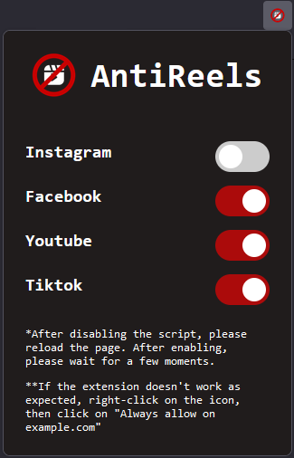
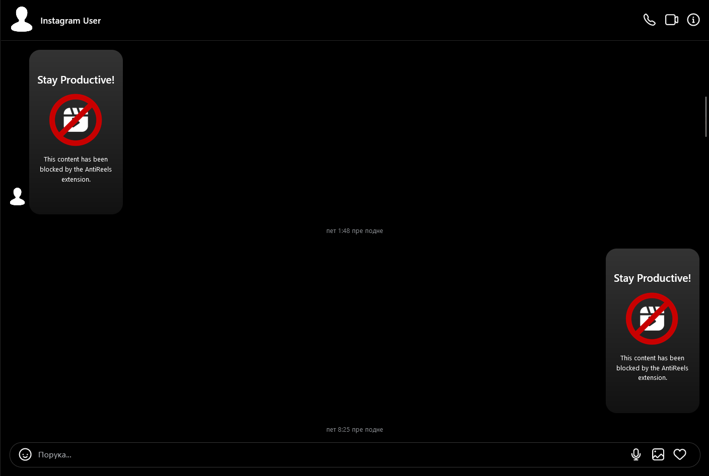
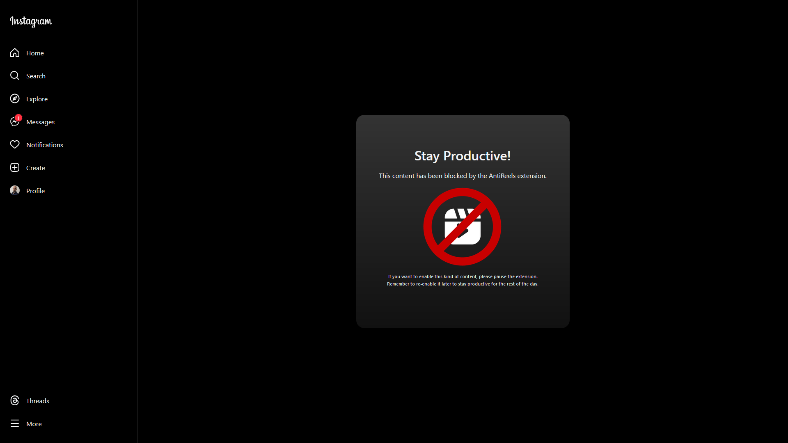

# AntiReels

## Description

AntiReels is a simple extension for Firefox and Chrome that helps you stay focused and productive by blocking short content from Facebook, Instagram, Tiktok and YouTube. It is designed for users who find themselves easily distracted by endless scrolling through short content on these social media platforms during work hours.

## Features:

- Cross-browser compatibility
- Selective blocking: Customize which social media platforms to block shorts from, giving you more control over your browsing experience.
    

- Instagram:

  - Hide reels from chat: With this new functionality, the extension allows you to hide reels from chat
  

  - Block reels access through direct links: Now, when you access reels directly, the extension will automatically hide them from your view
  

  - Hide reels from sidebar menu

- Facebook:

  - Hide reels from chat
  - Block reels access through direct links
  - Hide reels from sidebar menu
  - Hide reels on the homepage

- Youtube:

  - Block shorts access through direct links
  - Hide shorts from YouTube suggestions
  - Hide shorts from sidebar menu

- TikTok:

  - Completely block TikTok because the platform is entirely composed of short content

- It does not collect any personal data, ensuring your privacy and security while using the extension.
- Future Plans:
  - Timer functionality: Set a timer for watching shorts, and when the time is up, receive a popup notification and automatically stop playing the content.

By using AntiReels, you can maintain better focus, increase productivity, and regain control over your browsing habits.

## Installation:

- Firefox

The extension can be conveniently installed from the official Firefox Add-ons store [here](https://addons.mozilla.org/en-US/firefox/addon/antireels/).

- Chrome

For Chrome users, you can still follow these steps to manually install the extension:

1. Clone or download the repository to your local machine.
2. Open Chrome and type chrome://extensions in the address bar.
3. Toggle on the Developer mode option located in the top right corner.
4. Click on the Load unpacked button.
5. Navigate to the downloaded repository folder and select it.
6. The extension should now be loaded and ready to use in Chrome.

## Contributing

Contributions are welcome! If you have any ideas, bug fixes, or feature requests, feel free to submit a pull request.

## License

This project is licensed under the [MIT License](LICENSE).
